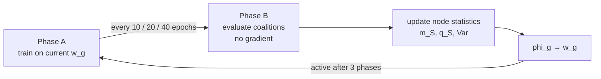

# Shapley-Guided VAE

> Dynamic Scaling of Reconstruction Error in Variational Autoencoders using Shapley Values\
> BSc thesis no. 2381, June 2026. Roko Čubrić, FER, University of Zagreb. Mentor: prof. dr. sc. Tomislav Burić.\

A model trained on several objectives requires a rule for how much each objective counts. In practice that rule is a set of constants, obtained by grid search and then held fixed for the remainder of the run. Two problems follow from it. The search cost grows with the number of tasks, and a constant assumes that the split which is correct at epoch 10 is still correct at epoch 150.

This work does not search for the split, but estimates it during training. The contribution of each auxiliary task is measured through its effect on the primary objective at the current state of the model, using Shapley values from cooperative game theory. In machine learning that concept normally appears as post-hoc attribution, as in the SHAP approach [1]. Here the same principle is moved inside the training loop and used to weight the terms of the loss function.

## The cooperative game

This section defines the game and the way its outcome enters the loss. First the players and the payoff are set up over the feature blocks, and then the resulting Shapley values are mapped into a distribution of a fixed auxiliary budget.

The experimental setting is the UCI Multiple Features dataset: 2000 handwritten digits, each described six separate times by six descriptor families, 649 floats in total [2]. The `pix` block, 240 pixel averages, is used as the primary reconstruction target, while the remaining five blocks are trained on auxiliary heads over a shared encoder and decoder trunk. The block structure is what makes the set suitable here — it gives an unambiguous definition of a player.

The five auxiliary blocks are treated as the players of a cooperative game, $D = \{\texttt{fou}, \texttt{fac}, \texttt{kar}, \texttt{zer}, \texttt{mor}\}$. For a coalition $S \subseteq D$, the input is formed by keeping the blocks in $S$ in their original form and replacing all blocks outside it, `pix` included, with a baseline value. Since the reconstruction loss decreases as the reconstruction improves, the payoff does not use that loss directly, but its relative change with respect to the full coalition. The payoff function is defined as

$$v(S) = \frac{L_{\text{pix}}(D) - L_{\text{pix}}(S)}{\lvert L_{\text{pix}}(D) \rvert + \epsilon}$$

It follows directly from the definition that $v(D) = 0$ — the full coalition is the reference point on the payoff scale. Every subset is therefore non-positive, and the marginal contribution of a player is positive exactly when adding its block improves the pixel reconstruction.

Negative Shapley values must not generate negative weights in the loss function. For that reason the raw values are not used directly; only the positive signal is retained and normalized, as

$$w_g = \frac{\max(\phi_g, 0)}{\sum_{h \in D} \max(\phi_h, 0)}$$

The auxiliary budget $\lambda_{\text{aux}} = 0.8$ remains fixed, and the Shapley values determine only its distribution among the blocks. In this way the training objective becomes

$$L = \ell_{\text{pix}} + \lambda_{\text{aux}} \sum_{g \in D} w_g \, \ell_g + \beta \, \mathrm{KL}$$

where the weights $w_g$ are refreshed periodically during training rather than fixed in advance.

## Estimating the values during training

Computing $\phi_g$ once is straightforward. The difficulty is obtaining it repeatedly, on a network that is still changing, at an acceptable cost, and three mechanisms address that.

Coalition values are held as nodes rather than sampled as permutations. For five players there are $2^{\lvert D \rvert} = 32$ nodes, each maintaining a rolling mean $m_S$ and a second moment $q_S$, from which the variance follows directly. The variance is not an incidental statistic here, since it drives the sampling decision described below.

Coalition values are also not stationary, because the network changes during training. A node value measured at epoch 60 does not belong to the same system as the same node measured at epoch 180, so an average over the full history is not an adequate choice. For that reason the effective observation count of each node is discounted before every update by a global progress factor, measured on the primary training loss between two sampling phases:

$$R_t = \mathrm{clip}\left(\frac{L^{\text{prev}}_{\text{pix}} - L^{\text{curr}}_{\text{pix}}}{\lvert L^{\text{prev}}_{\text{pix}} \rvert + \epsilon},\; 0,\; 1\right), \qquad N_{S,\text{pre}} = N_S \, (1 - R_t)$$

If progress is large, $R_t$ is close to 1 and the old estimates are suppressed quickly; if progress is small, they remain relevant. With an upper bound of $N_{\max} = 256$ on the effective history length, the nodes implement a short memory rather than a full average.

Sampling over the nodes is not uniform, but proportional to

$$p(S) \propto \sqrt{\widehat{\mathrm{Var}}(v(S))} \cdot c(S)$$

The first factor directs observations towards nodes whose estimates are still uncertain. The second is a structural factor describing how heavily a node is weighted in the Shapley sum, 1.0 for the empty and full coalitions and 0.2 in the middle, so structurally more important nodes receive proportionally more resources. A probability floor of 0.001 prevents any node from disappearing from sampling entirely.

None of the three mechanisms depends on $\lvert D \rvert = 5$. The node space grows as $2^{\lvert D \rvert}$, and the procedure is written to approximate that space rather than to enumerate it.

## Training schedule

Training alternates two phases. In phase A the model trains ordinarily on the current weights $w_g$; in phase B no parameters change, and coalition values are evaluated in order to refresh the node statistics.



The first 50 epochs are a warm-up at uniform weights $w_g = 1/5$. A bootstrap phase then evaluates all 32 nodes once, after which adaptive B phases follow at intervals that lengthen as the model settles. The dynamic weights do not enter phase A immediately after the first estimate; there is a delay of three sampling phases. This avoids a single noise-prone estimate beginning to steer the training.

The treatment of absent blocks is not merely a technical decision. Three tactics are compared: `baseline` replaces them with the training-set mean, `marginal` with a random row, and `conditional` with a random row of the same digit class. The marginal tactic produces off-manifold inputs and better tracks what the model actually uses, while the conditional tactic stays closer to the data distribution and distributes credit more sensibly among correlated blocks [1].

## Results

Four configurations were trained 50 times each with independent initialization — 200 trainings in total. The factor $\beta$ is controlled by a KL-target scheduler so that every model finishes at KL $5.00 \pm 0.02$. That control is necessary rather than cosmetic, since reconstruction error and KL divergence stand in a direct trade-off and a model under weaker regularization would reconstruct better for no methodological reason.

Table 1 reports the primary test, a regression of the final validation `pix` reconstruction on the final validation KL and a baseline indicator, with a one-sided hypothesis on the indicator coefficient.

**Table 1.** Shapley variants against the static uniform baseline, $N = 50$ per configuration.

| Masking tactic | $\beta_2$ | $p$ (one-sided) |
| -------------- | --------- | --------------- |
| `baseline`     | 0.001106  | 0.0007          |
| `marginal`     | 0.000980  | 0.0018          |
| `conditional`  | 0.002910  | $< 10^{-14}$    |

All three tactics are statistically significantly better than static uniform weighting. The conditional tactic gives an effect roughly three times larger than the other two and the narrowest confidence interval, which follows from its masked inputs remaining semantically coherent. The time cost of the sampling phases is 7.5% to 9.5%, or 12.85 s against 14.08 s per run.

The effect is nevertheless small in absolute terms, 0.001 to 0.003 in reconstruction loss and 0.3% to 0.9% relative. The result is therefore statistically significant but practically small.

## Limitations

The experiments support the basic hypothesis, that scaling the auxiliary loss by Shapley values is better than a static uniform distribution. Nevertheless, three limitations deserve explicit statement.

**The demonstration task.** A `pix_only` model, architecturally identical but with $\lambda_{\text{aux}} = 0$, reaches 0.304 against 0.318 for the static baseline and 0.316 for the best Shapley variant. The model with no auxiliary tasks reconstructs pixels best. This result is not necessarily unfavourable; rather it confirms the expected behaviour of multi-task learning, in which auxiliary tasks consume latent capacity that would otherwise be devoted entirely to the primary objective. It does mean, however, that the experiments do not prove this application of Shapley values to be a useful one, but only that the mechanism can be built, estimated stably during training, and used to distribute the auxiliary loss.

**The feedback mechanism.** The weights are coupled to the quantity they measure:

$$\text{larger } w_g \;\Rightarrow\; \text{larger loss share for } g \;\Rightarrow\; \text{better latent representation of } g \;\Rightarrow\; \text{larger } \phi_g$$

The rise of $w_{\texttt{fac}}$ from approximately 0.59 to 0.62 over a run is that loop. We cannot claim with certainty that `fac` is objectively the most useful block for the reconstruction; we can only state that under this training regime the model converged towards a distribution in which `fac` receives the largest share of the auxiliary budget. This is not necessarily a flaw, since the method relies on block contributions changing during training, but it remains the most important open methodological question.

**Scaling and robustness.** The space of coalition nodes grows exponentially with the number of players. The sampling algorithm is designed to approximate that space rather than enumerate it, but the evaluation was carried out in a controlled environment with 5 players and 32 nodes, so the behaviour of the algorithm on systems with a large number of players remains untested.

## Applicability

It remains an open question in which domains such an approach would have the greatest practical value. The more natural use cases are problems in which several modalities, sensors, tasks or signal sources genuinely compete for limited model capacity, and in which it is not clear in advance which auxiliary information contributes most to the main objective at which point in training: multi-modal and multi-sensor models, auxiliary self-supervised objectives attached to a supervised one, shared backbones with many heads. Fixed weights in those settings require a search over a space that grows with the task count, resolved once and then assumed stationary for the remainder of training, which is precisely the assumption this method removes.

What transfers from the experiment is the framework rather than the number: estimates that remain stable while the system beneath them changes, a sampling procedure written for exponential node spaces, and a measured overhead below 10%. Whether the framework pays for itself in a setting where the allocation genuinely matters has not been tested, and that is the natural next experiment.

## Repository

```
uv venv && uv sync --extra cpu      # or --extra cu121
python main.py --training-type baseline
python main.py --training-type shapley --shapley-tactic conditional
```

`run-training-variants.ps1` runs the baseline together with all three tactics. `pics/` holds the figures [thesis.tex](thesis.tex) compiles against.

This tree is an earlier state of the code than the runs reported above. The multi-head decoder and the $\lambda_{\text{aux}}$ split are not in it, and the CLI defaults (`--epochs 2000`, `--latent-dim 5`, `--hidden-dims 1024,1024`, `--kl-target 3.0`) belong to that earlier configuration, so they do not reproduce the reported numbers.

## References

1. Chen, H., Covert, I. C., Lundberg, S. M., Lee, S.-I. *Algorithms to estimate Shapley value feature attributions.* arXiv:2207.07605, 2022.
2. van Breukelen, M., Duin, R. P. W. *Multiple Features Dataset.* UCI Machine Learning Repository, 1998.
3. Peters, H. *Game Theory: A Multi-Leveled Approach.* Springer, 2015.
4. Yu, J., et al. *Unleashing the Power of Multi-Task Learning: A Comprehensive Survey Spanning Traditional, Deep, and Pretrained Foundation Model Eras.* arXiv:2404.18961, 2024.
5. Higgins, I., et al. *$\beta$-VAE: Learning Basic Visual Concepts with a Constrained Variational Framework.* ICLR, 2017.
