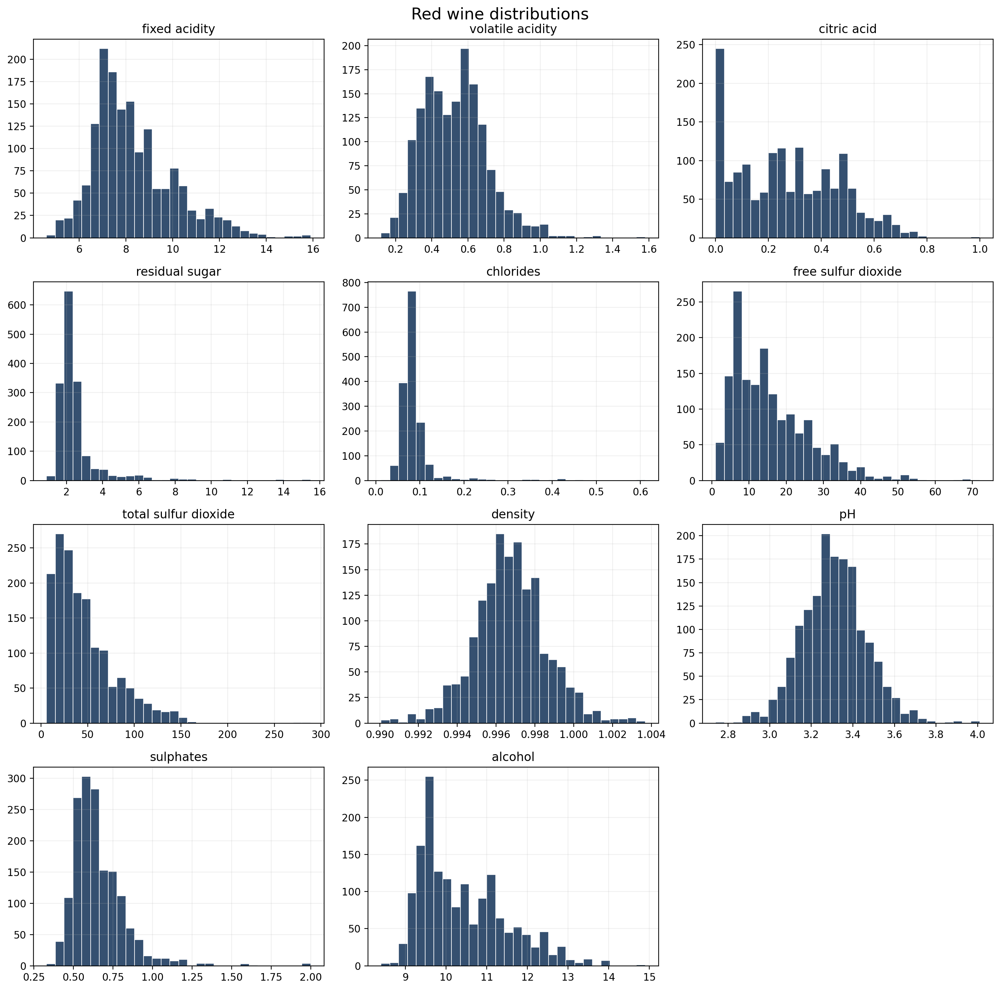
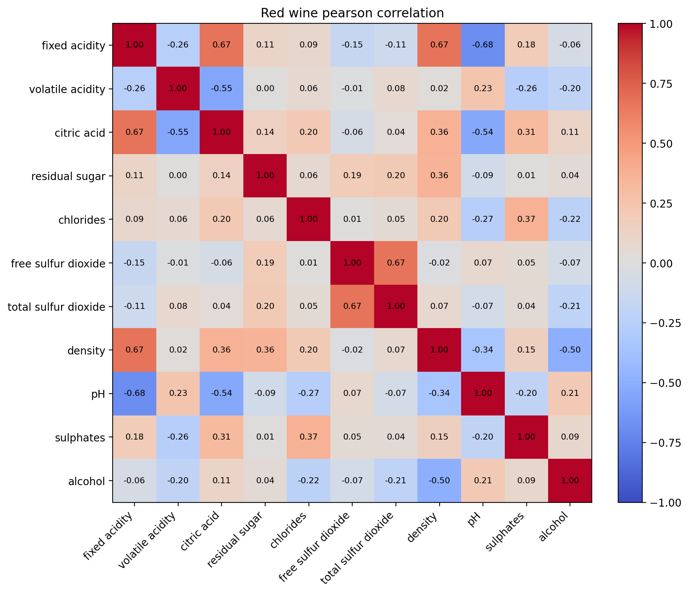
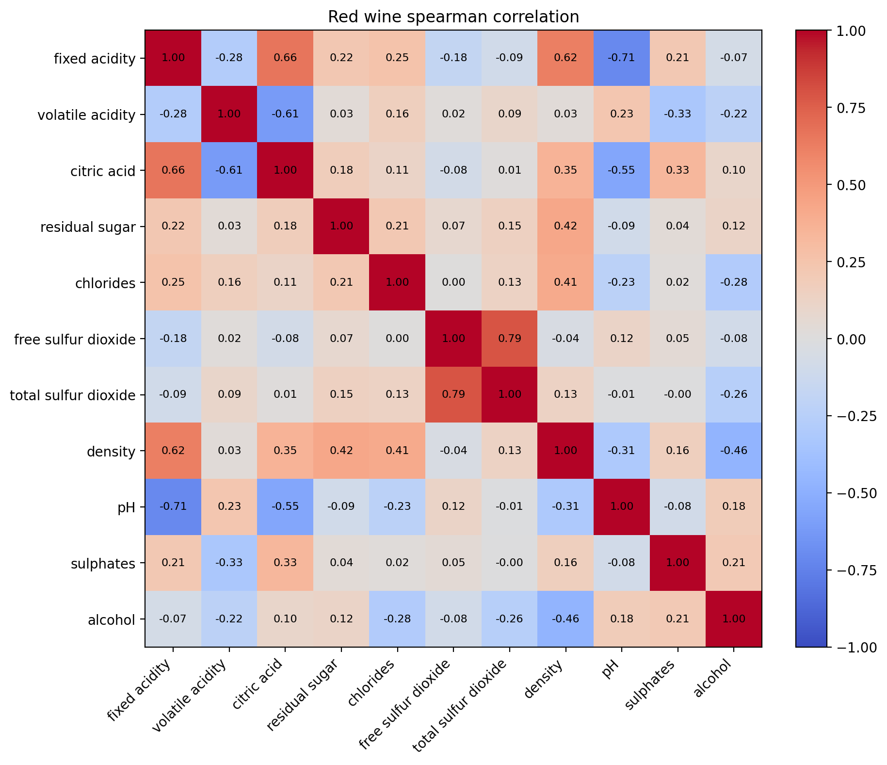
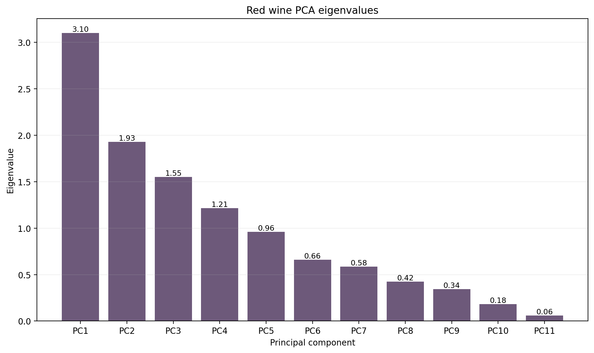
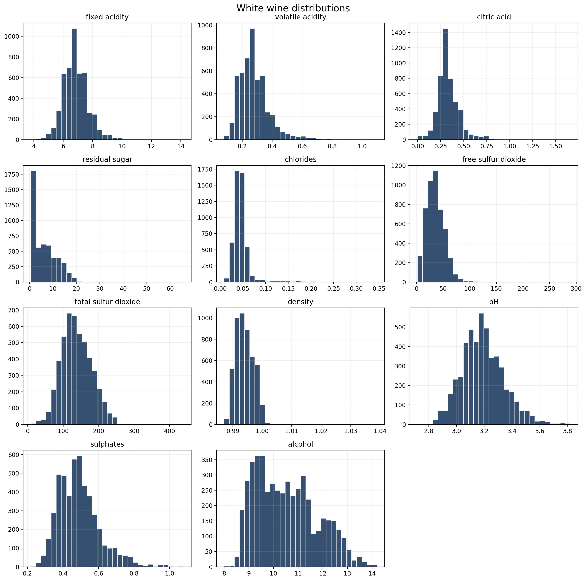
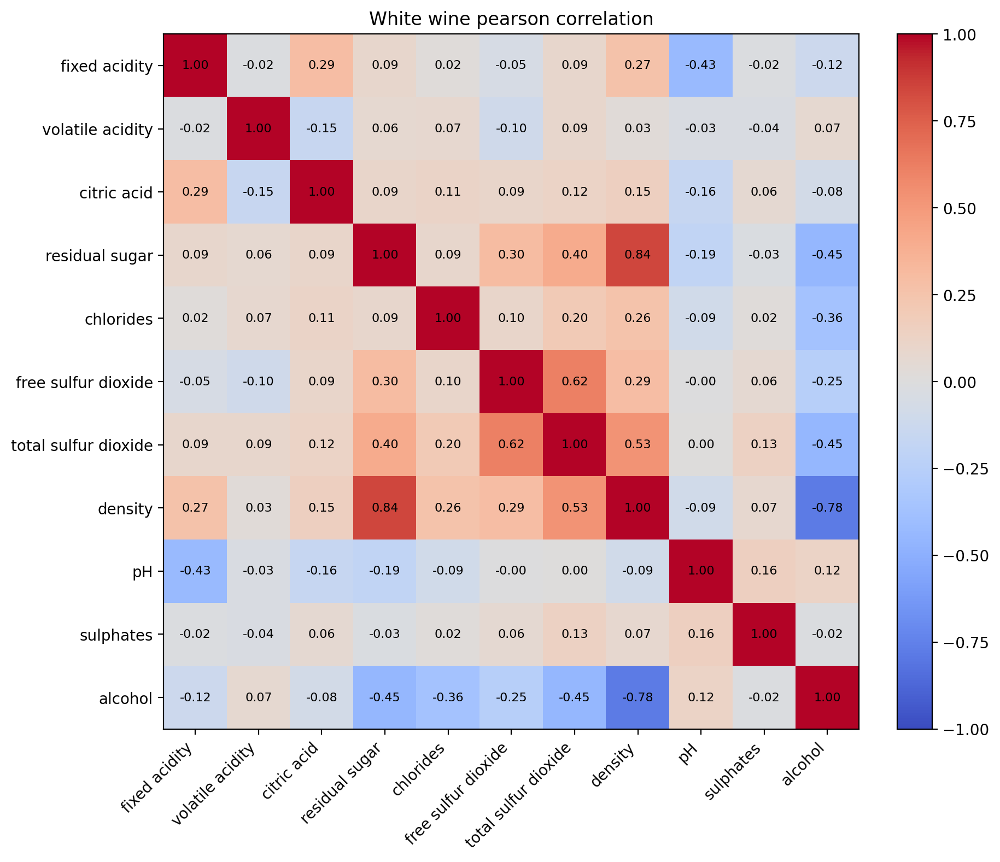
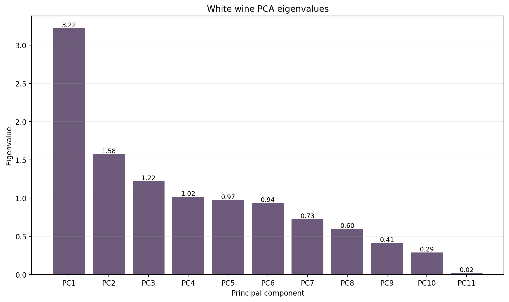
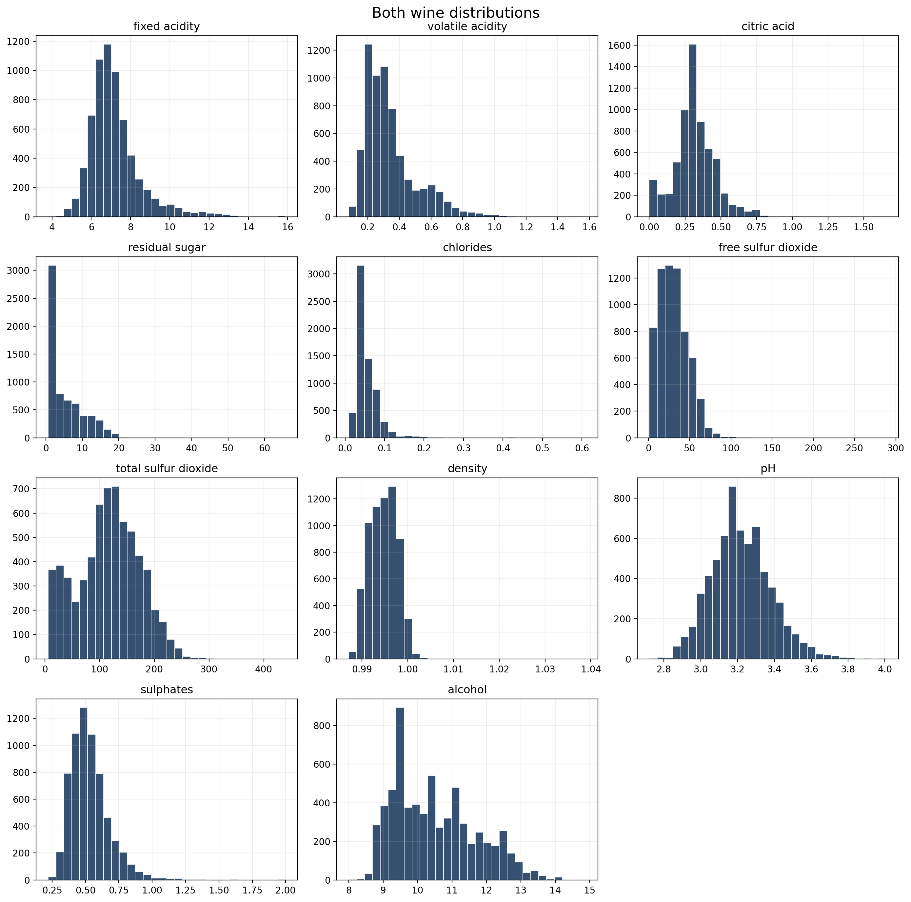
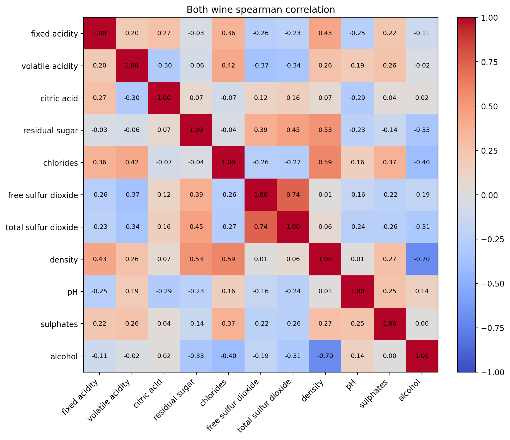
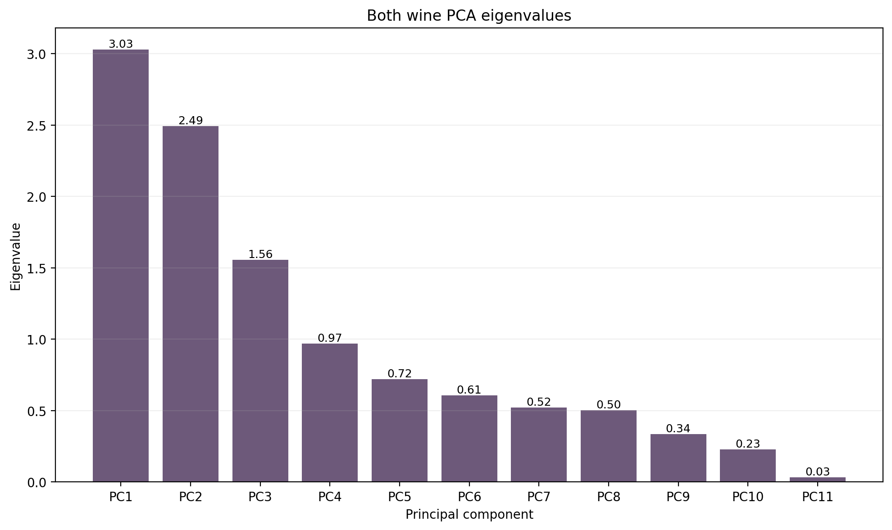

```{python}
from pathlib import Path

import pandas as pd

OUTPUT_DIR = Path("../analysis/output")


def read_indexed_csv(name):
    return pd.read_csv(OUTPUT_DIR / name, index_col=0)


def read_plain_csv(name):
    return pd.read_csv(OUTPUT_DIR / name)
```

## Red Wine

```{python}
read_indexed_csv("red_summary.csv")
```







```{python}
read_plain_csv("red_pca_summary.csv")
```



## White Wine

```{python}
read_indexed_csv("white_summary.csv")
```






```{python}
read_plain_csv("white_pca_summary.csv")
```



## Combined

```{python}
read_indexed_csv("both_summary.csv")
```






```{python}
read_plain_csv("both_pca_summary.csv")
```

